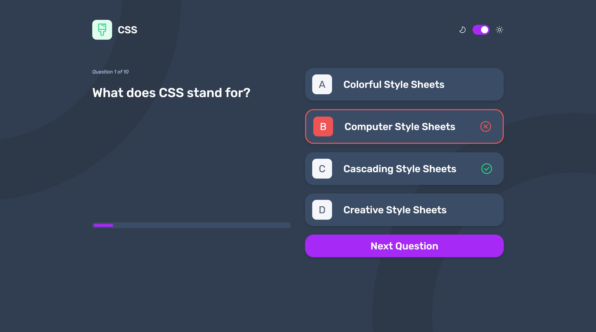

# Frontend Mentor - Frontend quiz app solution

This is a solution to the [Frontend quiz app challenge on Frontend Mentor](https://www.frontendmentor.io/challenges/frontend-quiz-app-BE7xkzXQnU). Frontend Mentor challenges help you improve your coding skills by building realistic projects.

## Overview

### The challenge

Users should be able to:

- Select a quiz subject
- Select a single answer from each question from a choice of four
- See an error message when trying to submit an answer without making a selection
- See if they have made a correct or incorrect choice when they submit an answer
- Move on to the next question after seeing the question result
- See a completed state with the score after the final question
- Play again to choose another subject
- View the optimal layout for the interface depending on their device's screen size
- See hover and focus states for all interactive elements on the page
- Navigate the entire app only using their keyboard
- **Bonus**: Change the app's theme between light and dark

### Screenshot

### Links

- Solution URL: [Frontend Mentor](https://www.frontendmentor.io/solutions/frontend-quiz-xVDWKkXBmq)
- Live Site URL: [Live Link - Hosted on Vercel](https://frontend-quiz-app-seven.vercel.app/)

## My process

### Built with

- Vite + React + Typescript
- Tailwind

### Useful resources

- [Tailwind Toggle Switch](https://flowbite.com/docs/forms/toggle/) - Creating a toggle switch using the Tailwind 'peer' class.
- [SVGs in React](https://dev.to/cassidoo/importing-svg-files-as-react-components-with-vite-l3n) - This helped me learn about Vite-Plugin-SVGR

## Author

- Frontend Mentor - [@jlyon12](https://www.frontendmentor.io/profile/jlyon12)
